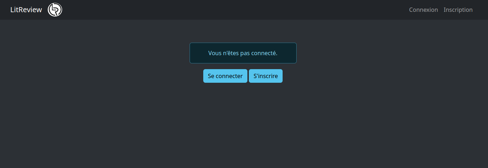
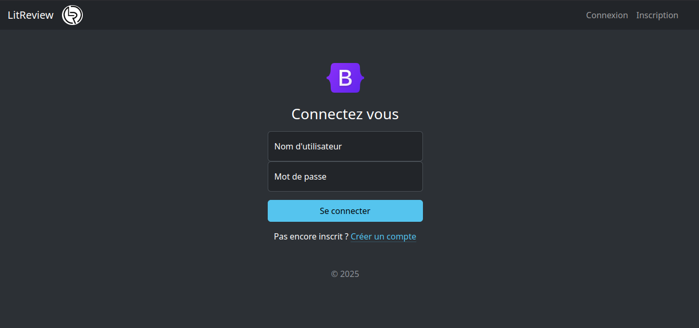
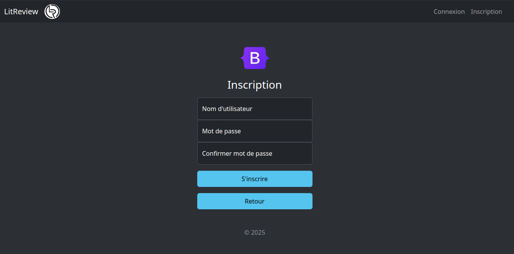
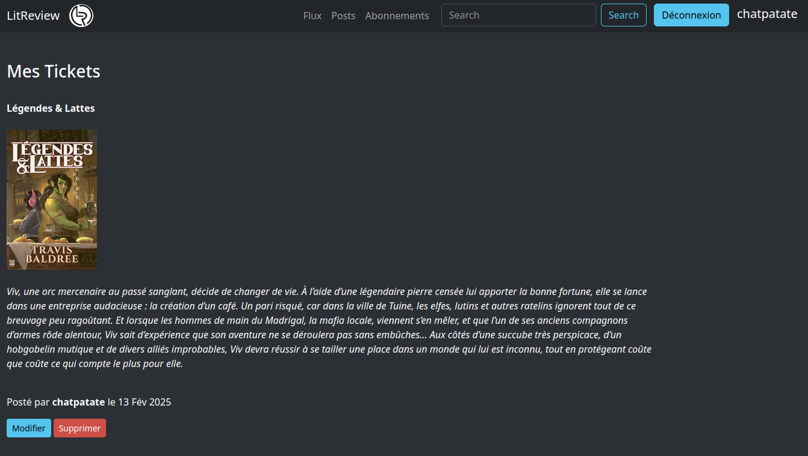
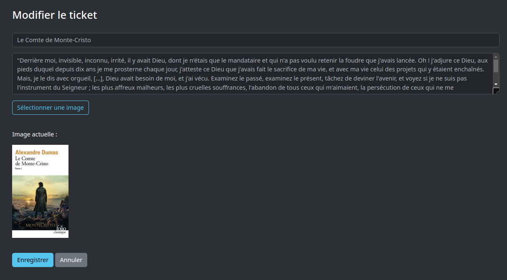
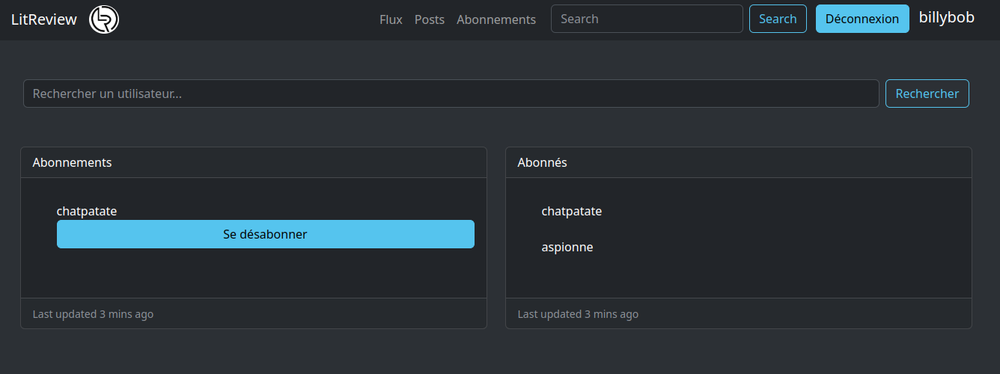

# P9_LitReview 📚✨

P9 LitReview est une application web permettant à une communauté d'utilisateurs de publier des critiques de livres, consulter des avis et solliciter des critiques sur des œuvres spécifiques.

## Fonctionnalités 🚀

Gestion des utilisateurs :
- Inscription et connexion : Création de compte sécurisé avec un identifiant et un mot de passe.
- Recherche d’utilisateurs : Trouver d’autres membres via leur nom d’utilisateur.
- Suivi d’utilisateurs : S’abonner à d’autres membres pour voir leurs critiques dans un flux personnalisé.

Critiques et Demandes d’avis :
- Publier des critiques sur des livres avec une note sur 5 étoiles et un commentaire détaillé.
- Créer une demande d’avis (ticket) pour solliciter une critique sur une œuvre spécifique.
- Répondre aux demandes d’avis avec une seule critique par ticket.
- Modifier ou supprimer ses propres critiques et tickets.

Flux d’actualité personnalisé :
- Voir les critiques et billets des utilisateurs suivis.
- Afficher ses propres critiques et demandes d’avis.
- Recevoir les critiques en réponse à ses propres demandes.

## Technologies utilisées 🛠️

L’application repose sur un stack Django avec un front-end moderne et responsive :

- Python 3.12 : Langage principal de développement.
- Django : Framework web pour la gestion des vues, modèles et authentification.
- HTML5 & CSS3 : Structure et mise en forme des pages.
- Bootstrap 5 : Framework CSS pour un design adaptatif et interactif.
- SQLite : Base de données utilisée pour stocker les utilisateurs, critiques et tickets.


## Installation & Configuration 🏗️

### Cloner le projet

```bash
git clone https://github.com/thehanatos/P9_LitReview.git
cd P9_LitReview
```

### Créer et activer un environnement virtuel

```bash
python -m venv env
source env/bin/activate  # Sur macOS/Linux
env\Scripts\activate      # Sur Windows
```
### Installer les dépendances

```bash
pip install -r requirements.txt
```

### Appliquer les migrations & Lancer le serveur
```bash
python manage.py migrate
python manage.py runserver
```

L’application sera accessible à l’adresse : http://127.0.0.1:8000/ 🌍


## Structure du projet 📂
```bash
Voici un aperçu de la structure du projet :  
P9_LitReview/
│
├── litreview/                    # Projet Django principal  
│   ├── settings.py                # Configuration Django  
│   ├── urls.py                    # Routage des vues  
│   ├── wsgi.py / asgi.py          # Point d’entrée du serveur  
│
├── authentification/              # Gestion des utilisateurs  
│   ├── forms.py                   # Formulaires Django pour l’authentification  
│   ├── views.py                   # Logique d'authentification  
│   ├── templates/authentification/ # Pages HTML (login, signup)  
│
├── billet/                        # Application pour les critiques et demandes d’avis  
│   ├── models.py                  # Définition des modèles (Ticket, Critic)  
│   ├── views.py                   # Logique métier des billets et critiques  
│   ├── templates/billet/          # Templates HTML liés aux billets  
│
├── subscriptions/                 # Gestion des abonnements  
│   ├── models.py                  # Modèle Subscription (suivi des utilisateurs)  
│   ├── views.py                   # Logique pour gérer les abonnements  
│   ├── templates/subscriptions/   # Templates pour la gestion des abonnements  
│
├── templates/                     # Dossier général contenant tous les fichiers HTML  
│   ├── base.html                   # Template de base  
│   ├── flux.html                   # Page affichant le fil d’actualité  
│   ├── subscriptions.html          # Page pour gérer les abonnements  
│
├── static/                        # Fichiers CSS et JS  
│   ├── styles.css                  # Styles personnalisés  
│   ├── script.js                   # Scripts JavaScript  
│
├── media/                         # Dossier pour stocker les images téléchargées  
│
├── screenshots/                  # Captures d'écran pour la documentation  
│
├── env/                           # Environnement virtuel (non inclus dans Git)  
│
├── db.sqlite3                      # Base de données SQLite  
├── manage.py                       # Outil de gestion Django  
├── requirements.txt                # Liste des dépendances  
└── README.md                       # Documentation du projet  

```

## Utilisation 🎯

Créer un compte utilisateur :
- Rendez-vous sur la page d'inscription, remplissez le formulaire avec un nom d’utilisateur et un mot de passe et cliquez sur "S'inscrire" pour valider votre inscription.

Se connecter
- Sur la page d’accueil, entrez identifiant et mot de passe et cliquez sur "Se connecter".

Publier une critique ou une demande d’avis
- Accédez à l’onglet Flux et cliquez sur le bouton "Créer un billet" pour rédiger un billet.
- Accédez à l’onglet Flux et cliquez sur le bouton "Demande de critique" pour publier un ticket.
- Accédez à "Creer une critique" sous les tickets des utilisateurs pour partager votre avis sur un livre.

 Rechercher et suivre des utilisateurs
- Accédez à l’onglet Abonnements et utilisez la barre de recherche pour trouver un utilisateur.
- Abonnez-vous pour voir ses critiques dans votre flux personnalisé.

## Aperçu de l'application 📸

Voici un aperçu de l’interface utilisateur, affichant les critiques et tickets de la communauté :















## Licence

Ce projet est sous licence MIT. Vous pouvez l’utiliser, le modifier et le partager librement.

